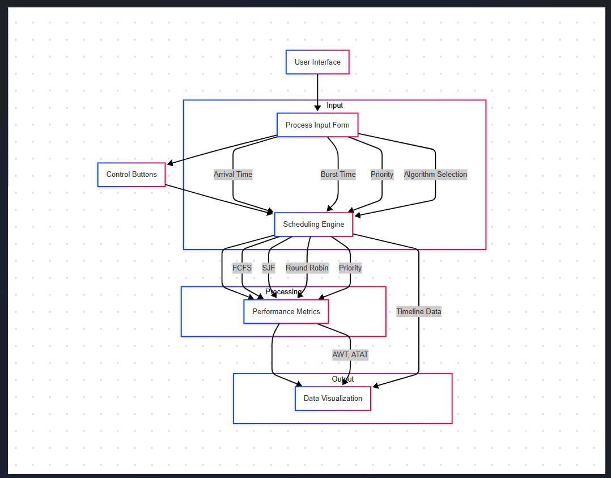

# Intelligent CPU Scheduler

## 🚀 Project Overview  
The **Intelligent CPU Scheduler** is a web-based simulator that visualizes various CPU scheduling algorithms in real time. It allows users to input process details (arrival time, burst time, and priority) and generates Gantt charts along with performance metrics such as:  
- **Average Waiting Time (AWT)**  
- **Average Turnaround Time (ATAT)**  

---

##  Functionalities  

**User Interface:**  
- Form input for process details: Arrival time, burst time, and priority  
- Control buttons: `Run`, `Reset`, `Clear`  
- Output display: Gantt charts and performance metrics  

 **Scheduling Engine:**  
- Supports **FCFS, SJF, Round Robin, and Priority Scheduling** algorithms  
- Real-time execution with Gantt chart visualization  
- Calculates AWT and ATAT dynamically  

**Data Visualization:**  
- Real-time Gantt chart display using **Chart.js**  
- Smooth execution animations using **Anime.js**  
- Performance metrics display  

---

## Technology Stack  

- **Languages:** HTML, CSS (Tailwind CSS), JavaScript  
- **Libraries:**  
  - [Chart.js](https://www.chartjs.org) → Gantt chart visualization  
  - [Anime.js](https://animejs.com) → Animation effects  
- **Tools:**  
  - **VS Code** → Development environment  
  - **GitHub** → Version control  
  - **Mermaid** → Flow diagrams  

---

## Flow Diagram  
```
User Input → Scheduling Engine → Data Visualization  



```

---

## Installation & Execution  

1. **Clone the repository:**  
```bash
git clone https://github.com/AdityaGupta2810/cpuscheduler.git
```

2. **Open the project folder:**  
```bash
cd cpuscheduler
```

3. **Launch the project:**  
- Open `index.html` in your browser  

---

## 🔎 Revision Tracking  

### 📂 GitHub Repository  
[**cpuscheduler**](https://github.com/AdityaGupta2810/cpuscheduler)


## Future Scope  

 **Additional Algorithms:**  
- Multilevel Queue Scheduling  
- Multilevel Feedback Queue Scheduling  

**Cloud Integration:**  
- Host the simulator on cloud platforms for global accessibility  

 **Enhanced Metrics:**  
- Display response time and CPU utilization  

 **Export Functionality:**  
- Download Gantt charts and metrics as PDF or image files  

 **Interactive Control:**  
- Introduce interactive controls like pausing and resuming execution  

---

📚 References  

- **Operating System Concepts** by Abraham Silberschatz  
- [Chart.js Documentation](https://www.chartjs.org)  
- [TailwindCSS Documentation](https://tailwindcss.com)  

---

## 🛠️ Author  
👤 **Aditya Gupta, Anil Kumar Choudhary, Navneet Singh**  
- **GitHub:** [AdityaGupta2810](https://github.com/AdityaGupta2810)  
- **Email:** adityagupta112040@gmail.com  

---

Feel free to fork, contribute, and raise issues to improve the project! 
